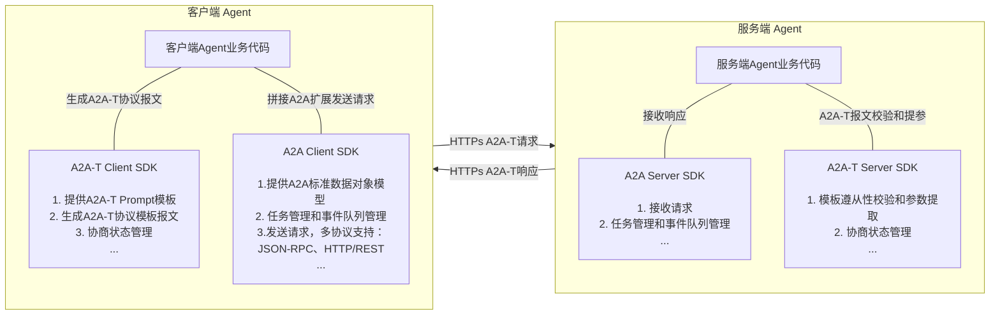
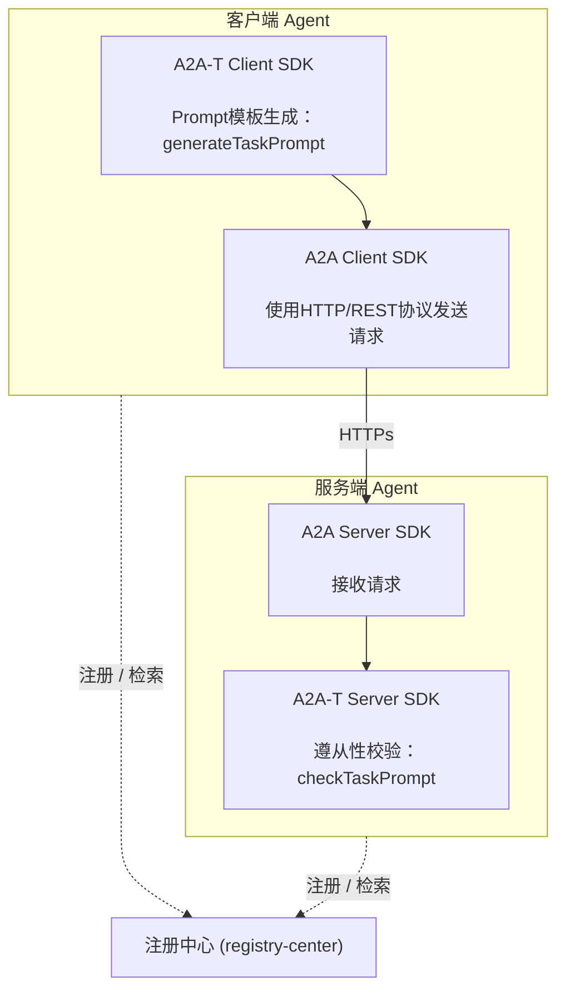
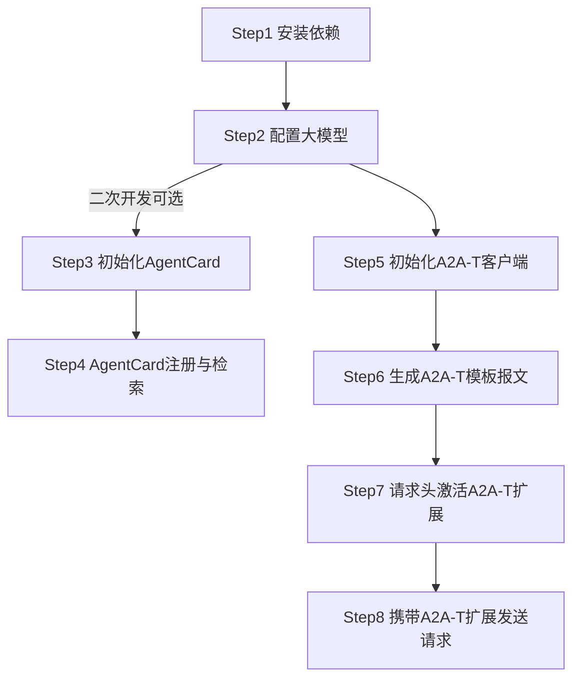
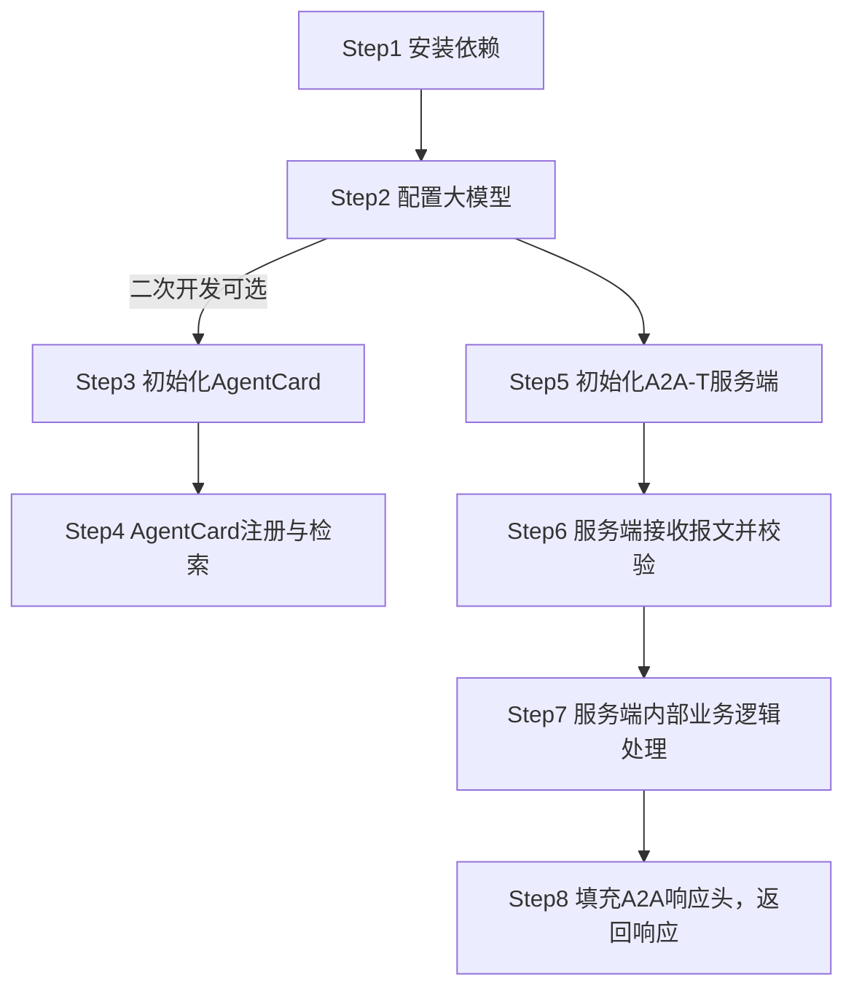

# 1 a2a-t-sdk-java 开发指南

| 分类     | 说明                                                         |
| -------- | ------------------------------------------------------------ |
| 目标读者 | 基于A2A-T SDK进行多智能体协议交互的开发者、集成部署人员、项目对接运维人员 |
| 文档目的 | 本文档详细介绍A2A-T SDK的完整安装方式、参数配置及最小实践。帮助使用者快速、规范地完成SDK接入、功能开发和线上落地。 |
| 阅读前提 | 了解A2A多智能体协议的数据模型定义和使用，了解AgentCard模型定义和使用，了解注册中心相关功能 |

## 1.1 特性介绍

### 1.1.1 A2A-T能力介绍
A2A-T（Agent-to-Agent Telecom）是基于A2A协议推出的电信领域多智能体互联协议，专为电信领域复杂协同场景设计。

业界通用智能体互联协议主要关注智能体互联和交互框架，对业务场景和具体交互内容关注不足，导致任务完成的成功率不高。电信领域的业务场景复杂、要求高，运维智能体互联和协同需要有专门的协议进行支撑。A2A-T方案基于A2A协议，重点针对电信领域业务流相关的信息模型、任务协商、协作安全等增强能力进行应用扩展。

a2a-t-sdk-java是面向电信智能体协作场景的 Java SDK，用于在 A2A-T 交互中生成、校验和协商任务提示词。SDK 适合客户端 Agent、服务端 Agent 以及上层编排系统集成使用。

主要能力包括：

- **客户端模板报文生成**：客户端根据自然语言或结构化输入生成符合 A2A-T 格式的协议报文。
- **服务端模板报文校验**：服务端校验客户端下发的 A2A-T协议格式报文 是否匹配场景、模板和槽位约束。
- **多轮协商管理**：支持`information`、`feasibility`、`target`协商流程。
- **模板资源管理**：内置场景、槽位、模板和系统提示词资源，支持`classpath`与本地文件两种资源加载方式。
- **LLM 适配**：通过 OpenAI-compatible 调用链接入外部大模型。

SDK提供的API列表和使用说明，详见 [API参考.md](API参考.md)。

### 1.1.2 A2A-T SDK与A2A SDK的关系

A2A-T协议是基于A2A协议的扩展，针对协议扩展的内容提供了A2A-T SDK，支撑快速构建满用于电信领域复杂协同场景的智能体。

A2A-T SDK独立于A2A SDK，通过同时集成A2A-T SDK与A2A SDK可以构建支持A2A-T协议的agent，支持电信领域多agent之间的确定性、高可靠、高效及安全协同。Java生态中可搭配的A2A SDK为a2a-java（`org.a2aproject.sdk`）。



### 1.1.3 A2A-T SDK典型交互场景

一个典型的多智能体协作交互场景至少涉及到三个组件：客户端Agent、服务端Agent、注册中心；

各组件间关系示例如下：




## 1.2 约束与限制

1. JDK 版本要求为 17+，构建工具要求 Maven 3.8+。
2. 完整的多智能体协议交互开发需要同时引入 A2A 官方 Java SDK（a2a-java，`org.a2aproject.sdk`），要求版本不小于 `1.0.0.Beta1` 。
3. 提示词资源支持 `classpath`（默认，从 `a2a-t-resources` jar 内置资源加载）和 `local_file`（本地文件资源）两种来源。
4. 协商状态存储仅提供 `in_memory`，进程退出后状态丢失。
5. A2A-T SDK 不提供 Agent HTTP 服务框架、注册中心客户端、鉴权和密钥管理能力，需由业务系统集成。

## 1.3 环境准备

### 1.3.1 环境要求

| 项目     | 要求                                     |
| -------- | ---------------------------------------- |
| Java     | JDK 17+                                  |
| 构建工具 | Maven 3.8+                               |
| LLM      | 需要可访问的 OpenAI 服务及 API Key       |
| 操作系统 | Linux、Windows、macOS 均可用于开发和联调 |

### 1.3.2 搭建环境

以Windows11 64位 amd64 开发环境为例

**安装JDK 17**

1. 官网下载链接：https://www.oracle.com/java/technologies/downloads/#java17（也可使用 Adoptium Temurin 等发行版：https://adoptium.net/temurin/releases/?version=17）

2. 下载 Windows x64 Installer（`.msi` 或 `.exe`）并以管理员身份执行

3. 安装时勾选或安装后手工配置环境变量：`JAVA_HOME` 指向 JDK 安装目录，并将 `%JAVA_HOME%\bin` 加入 `PATH`

4. 安装完成，打开终端输入校验命令：

   ```shell
   java -version
   # 预期输出：openjdk version "17.0.x" ...
   ```

**安装Maven**

1. 官网下载链接：https://maven.apache.org/download.cgi，下载 `apache-maven-3.9.x-bin.zip` 并解压到本地目录

2. 配置环境变量：`MAVEN_HOME` 指向解压目录，并将 `%MAVEN_HOME%\bin` 加入 `PATH`

3. 安装完成，输入校验命令：

   ```shell
   mvn -version
   # 预期输出：Apache Maven 3.9.x
   ```

## 1.4 基础开发样例

目的：通过提供A2A-T客户端和服务端的样例代码，帮助使用者快速、规范地熟悉SDK接入流程，加速功能开发和线上落地。

### 1.4.1 样例接口说明

本基础开发样例主要使用到A2A-T SDK如下两个API，实际开发过程中需按业务实际诉求选择不同API使用：

**1、A2A-T Client SDK**

接口定义及功能描述：根据输入内容识别场景生成对应的Prompt模板

```java
public PromptGenerationResult generateTaskPrompt(Object userInput)
```

`PromptGenerationResult` 为 record 类型，包含 `success()`、`promptText()`、`failure()` 三个访问器，`failure` 携带 `code`、`message`、`stage`。

接口调用样例：

```java
import java.nio.file.Path;
import net.openan.a2at.sdk.client.A2ATClient;
import net.openan.a2at.sdk.client.model.PromptGenerationResult;

A2ATClient client = new A2ATClient(Path.of("client.env"));
PromptGenerationResult result = client.generateTaskPrompt("请生成一个Incident事件订阅任务：通知主题为Incident，订阅级别为critical、medium、high、low，上报通知数据格式为DataPart");

if (result.success()) {
    System.out.println(result.promptText());
}

/*输出生成的prompt模板
## 订阅描述
请根据以下 <通知主题>、<订阅条件>、<上报通知数据格式>及<预期输出> 信息，完成网络侧智能故障Incident订阅与上报任务。

## 通知主题
通知主题该主题的名称是“incident”

## 订阅条件
故障级别为“critical”、“medium”、“high”、“low”

## 上报通知数据格式
通过DataPart上报Incident数据

## 预期输出
1、订阅结果，成功或失败
2、订阅失败原因（可选）
*/
```

**2、A2A-T Server SDK**

接口定义及功能描述：

```java
public PromptComplianceResult checkTaskPrompt(String processedPromptText)
```

`PromptComplianceResult` 为 record 类型，包含 `success()` 和 `failure()` 两个访问器（校验失败时 `failure` 携带 `code`、`message`、`stage`）。

接口调用样例：校验A2A-T协议报文的完备性

```java
import java.nio.file.Path;
import net.openan.a2at.sdk.server.A2ATServer;
import net.openan.a2at.sdk.server.model.PromptComplianceResult;

A2ATServer server = new A2ATServer(Path.of("server.env"));
PromptComplianceResult result = server.checkTaskPrompt("## 订阅描述请根据以下 <通知主题>、<订阅 条件>、<上报通知数据格式> 及 <预期输出> 信息，完成网络侧智能故障Incident的订阅与上报任务。## 通知主题该主题的名称是“incident”## 订阅条件 \n\n 故障级别为“critical”、“medium”、“high”、“low” \n\n ## 上报通知数据格式 \n\n通过DataPart上报Incident数据## 预期输出1、订阅结果，成功或失败2、订阅失 败原因（可选）");

if (result.success()) {
    System.out.println("prompt check passed");
} else {
    System.out.println(result.failure().message());
}
```

### 1.4.2 开发流程

- 客户端开发流程



> 二次开发指已基于A2A开发Agent，并对接过注册中心

- 服务端开发流程：




### 1.4.3 样例客户端开发步骤

#### Step1 安装依赖

业务项目可使用 BOM 统一管理 A2A-T SDK 版本：

```xml
<dependencyManagement>
    <dependencies>
        <dependency>
            <groupId>net.openan.a2a-t.sdk</groupId>
            <artifactId>a2a-t-bom</artifactId>
            <version>1.0.0</version>
            <type>pom</type>
            <scope>import</scope>
        </dependency>
    </dependencies>
</dependencyManagement>
```

客户端 Agent 引用：

```xml
<!-- A2A-T SDK -->
<dependency>
    <groupId>net.openan.a2a-t.sdk</groupId>
    <artifactId>a2a-t-client</artifactId>
</dependency>

<!-- A2A 官方 Java SDK -->
<dependency>
    <groupId>org.a2aproject.sdk</groupId>
    <artifactId>a2a-java-sdk-client</artifactId>
    <version>1.0.0.Beta1</version>
</dependency>
<dependency>
    <groupId>org.a2aproject.sdk</groupId>
    <artifactId>a2a-java-sdk-client-transport-rest</artifactId>
    <version>1.0.0.Beta1</version>
</dependency>
```

> 本指南样例中，A2A 请求统一通过 A2A 官方 Java SDK（a2a-java 的 `Client` + REST 传输）发送；
>
> 仅注册中心的注册与检索使用 JDK 内置 `HttpClient` 与 Jackson（注册中心不属于 a2a-java 能力范围，业务系统可替换为 OkHttp、Spring RestTemplate 等任意 HTTP 客户端和 JSON 库）。如需在客户端使用 Jackson，可添加：
>
> ```xml
> <dependency>
>  <groupId>com.fasterxml.jackson.core</groupId>
>  <artifactId>jackson-databind</artifactId>
>  <version>2.20.1</version>
> </dependency>
> ```

#### Step2 配置大模型

复制仓库根目录`env.example`文件内容到`client.env`中（服务端对应`server.env`），配置如下内容

```properties
A2AT_LANGUAGE=zh-CN
A2AT_PROMPT_SOURCE_TYPE=classpath
A2AT_PROMPT_RESOURCE_LOCAL_ROOT_DIR=
A2AT_PROMPT_COMPLIANCE_ENABLED=true
A2AT_LLM_PROVIDER=openai
A2AT_LLM_MODEL=deepseek-chat
A2AT_LLM_API_KEY={your_llm_api_key}
A2AT_LLM_BASE_URL=https://api.deepseek.com
A2AT_NEGOTIATION_STATE_STORE_TYPE=in_memory
A2AT_INPUT_TEXT_MAX_CHARS=16384
```

> `A2AT_LLM_API_KEY` 是**调用外部大模型**使用的密钥，请妥善保存
>
> SDK 通过 OpenAI-compatible 接入外部大模型，`A2AT_LLM_PROVIDER` 当前仅支持 `openai`；接入 DeepSeek 等 OpenAI 兼容服务时，通过 `A2AT_LLM_BASE_URL` 指定服务地址、`A2AT_LLM_MODEL` 指定模型名。
>
> 提示词资源来源由 `A2AT_PROMPT_SOURCE_TYPE` 控制：默认 `classpath` 从 `a2a-t-resources` jar 内置资源加载；配置为 `local_file` 时，通过 `A2AT_PROMPT_RESOURCE_LOCAL_ROOT_DIR` 指定本地资源根目录（相对路径相对于 `.env` 文件所在目录解析）。
>
> 自由文本输入在任何 LLM 调用之前都会做长度防护：所有接受自然语言 `String` 的 Facade 入口（`FromText` 生成类方法、文本形式的 `generateTaskPrompt`，以及 `checkTaskPrompt`、`validate*PromptAndDataFilling` 等校验入口）在输入超过 `A2AT_INPUT_TEXT_MAX_CHARS` 字符（按 `String.length()` 计）时，会以错误码 `input_text_too_long` 快速失败，避免超长输入撑爆 LLM 上下文。该键默认 `16384`（16×1024）；非法或非正值回退默认值并输出警告日志。防护不做截断：是否以及如何缩短输入完全由调用方决定。结构化（`Map`）输入不做该检查。

#### Step3 初始化AgentCard

a2a-java 官方推荐使用 Builder 构造 `AgentCard`（`org.a2aproject.sdk.spec.AgentCard`），可在 `capabilities.extensions` 中声明支持的 A2A-T 模板；注册到注册中心时，AgentCard 序列化为 JSON（外层包装为 `{"agentCards": [...]}`）。

- 客户端样例AgentCard定义参考（可在`extensions`中声明支持的A2A-T模板）：

```java
import java.util.List;
import org.a2aproject.sdk.spec.AgentCapabilities;
import org.a2aproject.sdk.spec.AgentCard;
import org.a2aproject.sdk.spec.AgentExtension;
import org.a2aproject.sdk.spec.AgentInterface;
import org.a2aproject.sdk.spec.AgentProvider;
import org.a2aproject.sdk.spec.AgentSkill;

private static final String TASK_T_EXT =
        "https://projects.tmforum.org/a2aproject/telecommunication/extensions/Task-T/v1";
private static final String NOTIFICATION_T_EXT =
        "https://projects.tmforum.org/a2aproject/telecommunication/extensions/Notification-T/v1";

private static AgentCard buildClientAgentCard() {
    return AgentCard.builder()
            .name("Transmission workbench agent")
            .description("传输网络运维管理智能体，提供电路恢复验证、基站退服根因分析、网元隐患排查等运维能力")
            .provider(new AgentProvider("ZzNode", "https://example.com"))
            .version("1.0.0")
            .capabilities(AgentCapabilities.builder()
                    .streaming(true)
                    .pushNotifications(false)
                    .extendedAgentCard(false)
                    .extensions(List.of(
                            AgentExtension.builder()
                                    .uri(TASK_T_EXT)
                                    .description("Extension of structured prompt Task-T requests.")
                                    .build(),
                            AgentExtension.builder()
                                    .uri(NOTIFICATION_T_EXT)
                                    .description("Extension of structured prompt Notification-T requests.")
                                    .build()))
                    .build())
            .defaultInputModes(List.of("application/json", "text/plain"))
            .defaultOutputModes(List.of("application/json", "text/plain"))
            .skills(List.of(
                    AgentSkill.builder()
                            .id("circuit-recovery-verification")
                            .name("电路恢复验证智能体")
                            .description("电路业务恢复验证技能。根据请求中的电路名称，代入固定JSON模板返回业务恢复验证结果。当用户提到“业务恢复验证”、“电路恢复验证”、“circuit recovery verification”或类似请求时使用。适用于需要对指定电路进行业务恢复状态确认的场景。")
                            .tags(List.of("电路恢复验证", "业务恢复验证", "circuit-recovery"))
                            .examples(List.of(
                                    "请对电路：LYSPELC3、SN3二期-LYXLSJLT1号楼10GE1049641NR进行业务恢复验证",
                                    "对电路XXX进行业务恢复验证",
                                    "circuit recovery verification for circuit XXX"))
                            .inputModes(List.of("application/json", "text/plain"))
                            .outputModes(List.of("application/json", "text/plain"))
                            .build(),
                    AgentSkill.builder()
                            .id("ne-hidden-danger")
                            .name("网元隐患排查智能体")
                            .description("网元隐患排查技能。根据输入的网元名称，排查该网元是否还存在新的隐患。当用户提到“隐患排查”、“检查隐患”、“网元排查”、“ne hidden danger”或类似请求时使用。适用于需要对指定网元进行隐患状态检查的场景。")
                            .tags(List.of("网元排查", "隐患排查", "NE-inspection"))
                            .examples(List.of(
                                    "请排查QZHA-HAZBYSDGG-HRHH网元是否还产生新隐患",
                                    "排查网元XXX是否还存在隐患",
                                    "Check if NE XXX has any hidden dangers"))
                            .inputModes(List.of("application/json", "text/plain"))
                            .outputModes(List.of("application/json", "text/plain"))
                            .build()))
            .supportedInterfaces(List.of(
                    new AgentInterface("HTTP+JSON", "http://10.xx.xx.xx:26335/a2a/v1", "", "1.0")))
            .build();
}
```

- 客户端样例AgentCard Json报文参考：

```json
{
  "agentCards": [
    {
      "name": "Transmission workbench agent",
      "description": "传输网络运维管理智能体，提供电路恢复验证、基站退服根因分析、网元隐患排查等运维能力",
      "supportedInterfaces": [
        {
          "url": "http://10.xx.xx.xx:26335/a2a/v1",
          "protocolBinding": "HTTP+JSON",
          "protocolVersion": "1.0"
        }
      ],
      "provider": {
        "organization": "ZzNode"
      },
      "version": "1.0.0",
      "capabilities": {
        "streaming": true,
        "pushNotifications": false,
        "extensions": [
          {
            "uri": "https://projects.tmforum.org/a2aproject/telecommunication/extensions/Task-T/v1",
            "description": "Extension of structured prompt Task-T requests."
          },
          {
            "uri": "https://projects.tmforum.org/a2aproject/telecommunication/extensions/Notification-T/v1",
            "description": "Extension of structured prompt Notification-T requests."
          }
        ],
        "extendedAgentCard": false
      },
      "securitySchemes": {
        "bearerAuth": {
          "httpAuthSecurityScheme": {
            "description": "使用用户名和密码通过登录接口查询accessSession后，使用该accessSession进行bearer认证。",
            "scheme": "Bearer"
          }
        }
      },
      "defaultInputModes": [
        "application/json",
        "text/plain"
      ],
      "defaultOutputModes": [
        "application/json",
        "text/plain"
      ],
      "skills": [
        {
          "id": "circuit-recovery-verification",
          "name": "电路恢复验证智能体",
          "description": "电路业务恢复验证技能。根据请求中的电路名称，代入固定JSON模板返回业务恢复验证结果。当用户提到“业务恢复验证”、“电路恢复验证”、“circuit recovery verification”或类似请求时使用。适用于需要对指定电路进行业务恢复状态确认的场景。",
          "tags": [
            "电路恢复验证",
            "业务恢复验证",
            "circuit-recovery"
          ],
          "examples": [
            "请对电路：LYSPELC3、SN3二期-LYXLSJLT1号楼10GE1049641NR进行业务恢复验证",
            "对电路XXX进行业务恢复验证",
            "circuit recovery verification for circuit XXX"
          ],
          "inputModes": [
            "application/json",
            "text/plain"
          ],
          "outputModes": [
            "application/json",
            "text/plain"
          ]
        },
        {
          "id": "ne-hidden-danger",
          "name": "网元隐患排查智能体",
          "description": "网元隐患排查技能。根据输入的网元名称，排查该网元是否还存在新的隐患。当用户提到“隐患排查”、“检查隐患”、“网元排查”、“ne hidden danger”或类似请求时使用。适用于需要对指定网元进行隐患状态检查的场景。",
          "tags": [
            "网元排查",
            "隐患排查",
            "NE-inspection"
          ],
          "examples": [
            "请排查QZHA-HAZBYSDGG-HRHH网元是否还产生新隐患",
            "排查网元XXX是否还存在隐患",
            "Check if NE XXX has any hidden dangers"
          ],
          "inputModes": [
            "application/json",
            "text/plain"
          ],
          "outputModes": [
            "application/json",
            "text/plain"
          ]
        }
      ]
    }
  ]
}
```

#### Step4 AgentCard注册与检索

- **AgentCard注册**：将客户端AgentCard发布到注册中心，注册中心的地址和URI以实际部署情况为准

```java
import java.net.URI;
import java.net.http.HttpClient;
import java.net.http.HttpRequest;
import java.net.http.HttpResponse;
import java.util.List;
import java.util.Map;
import com.fasterxml.jackson.annotation.JsonInclude;
import com.fasterxml.jackson.databind.ObjectMapper;
import org.a2aproject.sdk.spec.AgentCard;

private static final HttpClient HTTP_CLIENT = HttpClient.newHttpClient();
private static final ObjectMapper MAPPER = new ObjectMapper().setSerializationInclusion(JsonInclude.Include.NON_NULL);

private static void registerAgentCard(String registryBaseUrl, AgentCard agentCard)
        throws Exception {
    String payload = MAPPER.writeValueAsString(Map.of("agentCards", List.of(agentCard)));
    HttpRequest request = HttpRequest.newBuilder()
            .uri(URI.create(registryBaseUrl + "/rest/v1/registry-center/agent-cards"))
            .header("Content-Type", "application/json")
            .POST(HttpRequest.BodyPublishers.ofString(payload))
            .build();
    HttpResponse<String> response = HTTP_CLIENT.send(request, HttpResponse.BodyHandlers.ofString());
    if (response.statusCode() != 201) {
        throw new IllegalStateException("AgentCard registration failed: " + response.statusCode());
    }
}
```

- **AgentCard检索**：根据目标Agent名称或技能，从注册中心查询并获取其 AgentCard，从而得到 `url` 和支持的技能

```java
import java.util.List;
import java.util.Map;
import com.fasterxml.jackson.core.type.TypeReference;

private static Map<String, Object> discoverAgent(
        String registryBaseUrl, String organization, String name) throws Exception {
    HttpRequest request = HttpRequest.newBuilder()
            .uri(URI.create(registryBaseUrl + "/rest/v1/registry-center/agent-cards/"
                    + organization + "/" + name))
            .GET()
            .build();
    HttpResponse<String> response = HTTP_CLIENT.send(request, HttpResponse.BodyHandlers.ofString());
    if (response.statusCode() >= 400) {
        throw new IllegalStateException("AgentCard query failed: " + response.statusCode());
    }
    Map<String, Object> payload =
            MAPPER.readValue(response.body(), new TypeReference<Map<String, Object>>() {});
    return (Map<String, Object>) ((List<?>) payload.get("agentCards")).get(0);
}
```

检索结果为注册中心返回的 JSON 结构。由于 a2a-java 的 `Client.builder(...)` 接收 `org.a2aproject.sdk.spec.AgentCard` 对象，需将其转换为官方 AgentCard 模型：

```java
import java.util.List;
import java.util.Map;
import org.a2aproject.sdk.spec.AgentCapabilities;
import org.a2aproject.sdk.spec.AgentCard;
import org.a2aproject.sdk.spec.AgentExtension;
import org.a2aproject.sdk.spec.AgentInterface;
import org.a2aproject.sdk.spec.AgentProvider;
import org.a2aproject.sdk.spec.AgentSkill;

@SuppressWarnings("unchecked")
private static AgentCard toAgentCard(Map<String, Object> registryAgentCard) {
    Map<String, Object> provider = (Map<String, Object>) registryAgentCard.getOrDefault("provider", Map.of());
    Map<String, Object> capabilities = (Map<String, Object>) registryAgentCard.getOrDefault("capabilities", Map.of());
    List<Map<String, Object>> extensionMaps =
            (List<Map<String, Object>>) capabilities.getOrDefault("extensions", List.of());
    List<Map<String, Object>> skillMaps =
            (List<Map<String, Object>>) registryAgentCard.getOrDefault("skills", List.of());
    List<Map<String, Object>> interfaceMaps =
            (List<Map<String, Object>>) registryAgentCard.getOrDefault("supportedInterfaces", List.of());

    return AgentCard.builder()
            .name(string(registryAgentCard.get("name")))
            .description(string(registryAgentCard.get("description")))
            .provider(new AgentProvider(string(provider.get("organization")), string(provider.get("url"))))
            .version(string(registryAgentCard.get("version")))
            .capabilities(AgentCapabilities.builder()
                    .streaming(Boolean.TRUE.equals(capabilities.get("streaming")))
                    .pushNotifications(Boolean.TRUE.equals(capabilities.get("pushNotifications")))
                    .extendedAgentCard(Boolean.TRUE.equals(capabilities.get("extendedAgentCard")))
                    .extensions(extensionMaps.stream()
                            .map(extension -> AgentExtension.builder()
                                    .uri(string(extension.get("uri")))
                                    .description(string(extension.get("description")))
                                    .required(Boolean.TRUE.equals(extension.get("required")))
                                    .build())
                            .toList())
                    .build())
            .defaultInputModes(stringList(registryAgentCard.get("defaultInputModes")))
            .defaultOutputModes(stringList(registryAgentCard.get("defaultOutputModes")))
            .skills(skillMaps.stream()
                    .map(skill -> AgentSkill.builder()
                            .id(string(skill.get("id")))
                            .name(string(skill.get("name")))
                            .description(string(skill.get("description")))
                            .tags(stringList(skill.get("tags")))
                            .build())
                    .toList())
            .supportedInterfaces(interfaceMaps.stream()
                    .map(agentInterface -> new AgentInterface(
                            string(agentInterface.get("protocolBinding")),
                            string(agentInterface.get("url")),
                            string(agentInterface.getOrDefault("tenant", "")),
                            string(agentInterface.getOrDefault("protocolVersion", "1.0"))))
                    .toList())
            .build();
}

private static String string(Object value) {
    return value == null ? "" : String.valueOf(value);
}

private static List<String> stringList(Object value) {
    return value instanceof List<?> values ? values.stream().map(String::valueOf).toList() : List.of();
}
```

#### Step5 初始化A2A-T客户端

```java
import java.nio.file.Path;
import net.openan.a2at.sdk.client.A2ATClient;

A2ATClient client = new A2ATClient(Path.of("client.env"));
```

`A2ATClient` 与 `A2ATServer` 均在构造时显式传入 `.env` 文件路径（Java SDK 不自动发现配置文件），路径相对于进程工作目录解析，建议使用绝对路径。

#### Step6 生成A2A-T模板报文

客户端使用A2A-T Client SDK API `generateTaskPrompt`生成 processed_prompt，再将其作为 A2A 消息的一部分发送给目标 agent。

```java
import java.nio.file.Path;
import net.openan.a2at.sdk.client.A2ATClient;
import net.openan.a2at.sdk.client.model.PromptGenerationResult;

A2ATClient client = new A2ATClient(Path.of("client.env"));

// 生成 A2A-T 提示词
PromptGenerationResult result = client.generateTaskPrompt("请生成一个Incident事件订阅任务：通知主题为Incident，订阅级别为critical、medium、high、low，上报通知数据格式为DataPart");
if (!result.success()) {
    throw new IllegalStateException(result.failure().code() + ": " + result.failure().message());
}

String processedPrompt = result.promptText();
```

#### Step7 请求头激活A2A-T扩展

A2A 协议通过 HTTP Header 传递协议版本与扩展声明，需使用如下Header

| Header           | 方向   | 必填                 | 取值                                              |
| ---------------- | ------ | -------------------- | ------------------------------------------------- |
| `A2A-Version`    | 请求头 | 是                   | 协议版本，如 `1.0`（客户端必须随每个请求携带）    |
| `A2A-Extensions` | 请求头 | 否（使用扩展时建议） | 逗号分隔的扩展 URI 列表，声明本次请求要使用的扩展 |

客户端请求头填写样例：使用 a2a-java 发送请求时，`A2A-Extensions` 通过 `ClientCallContext` 的 headers 传入（协议版本等协议头由 a2a-java 传输层按协议要求携带）

```java
import java.util.Map;
import org.a2aproject.sdk.client.transport.spi.interceptors.ClientCallContext;

String notificationPromptExt = "https://projects.tmforum.org/a2aproject/telecommunication/extensions/Notification-T/v1";

ClientCallContext callContext =
        new ClientCallContext(Map.of(), Map.of("A2A-Extensions", notificationPromptExt));
```

#### Step8 携带A2A-T扩展发送请求

使用 a2a-java 官方 SDK 发送请求：processed prompt 放入 `Message.metadata`（以扩展 URI 为 key），请求头通过 `ClientCallContext` 声明，由 `Client` 经 REST 传输发送。

```java
import java.nio.file.Path;
import java.util.List;
import java.util.Map;
import java.util.UUID;
import java.util.concurrent.CountDownLatch;
import net.openan.a2at.sdk.client.A2ATClient;
import net.openan.a2at.sdk.client.model.PromptGenerationResult;
import org.a2aproject.sdk.client.Client;
import org.a2aproject.sdk.client.ClientEvent;
import org.a2aproject.sdk.client.MessageEvent;
import org.a2aproject.sdk.client.TaskUpdateEvent;
import org.a2aproject.sdk.client.transport.rest.RestTransport;
import org.a2aproject.sdk.client.transport.rest.RestTransportConfig;
import org.a2aproject.sdk.client.transport.spi.interceptors.ClientCallContext;
import org.a2aproject.sdk.spec.AgentCard;
import org.a2aproject.sdk.spec.Message;
import org.a2aproject.sdk.spec.MessageSendParams;
import org.a2aproject.sdk.spec.TaskArtifactUpdateEvent;
import org.a2aproject.sdk.spec.TaskStatusUpdateEvent;
import org.a2aproject.sdk.spec.TextPart;

String notificationPromptExt = "https://projects.tmforum.org/a2aproject/telecommunication/extensions/Notification-T/v1";

// 1) 生成 A2A-T 提示词（见1.4.4.6）
A2ATClient client = new A2ATClient(Path.of("client.env"));
PromptGenerationResult result = client.generateTaskPrompt("请生成一个Incident事件订阅任务：通知主题为Incident，订阅级别为critical、medium、high、low，上报通知数据格式为DataPart");
if (!result.success()) {
    throw new IllegalStateException(result.failure().code() + ": " + result.failure().message());
}
String processedPrompt = result.promptText();

// 2) 构造携带A2A-T扩展的A2A消息（prompt放入metadata，以扩展URI为key）
Message message = Message.builder()
        .messageId(UUID.randomUUID().toString())
        .role(Message.Role.ROLE_USER)
        .parts(new TextPart("创建智能故障incident上报任务"))
        .metadata(Map.of(notificationPromptExt, processedPrompt))
        .build();
MessageSendParams params = MessageSendParams.builder().message(message).build();

// 3) 通过 ClientCallContext 声明A2A-T扩展请求头（见1.4.4.7）
ClientCallContext callContext =
        new ClientCallContext(Map.of(), Map.of("A2A-Extensions", notificationPromptExt));

// 4) 使用 a2a-java Client 发送请求并消费任务事件
CountDownLatch done = new CountDownLatch(1);
try (Client a2aClient = Client.builder(agentCard)  // 1.4.4.5 检索并转换后的 org.a2aproject.sdk.spec.AgentCard
        .withTransport(RestTransport.class, new RestTransportConfig())
        .build()) {
    a2aClient.sendMessage(
            params,
            List.of((event, ignored) -> handleEvent(event, done)),
            throwable -> {
                throwable.printStackTrace();
                done.countDown();
            },
            callContext);
    // AgentCard声明streaming=true时走message:stream流式，sendMessage立即返回，等待任务进入终态；
    // 否则走message:send阻塞模式，sendMessage返回时任务已结束
    done.await();
}

private static void handleEvent(ClientEvent event, CountDownLatch done) {
    if (event instanceof TaskUpdateEvent update) {
        if (update.getUpdateEvent() instanceof TaskStatusUpdateEvent statusUpdate) {
            System.out.println("task-status: " + statusUpdate.status().state());
            if (statusUpdate.status().state().isFinal()) {
                done.countDown();
            }
        } else if (update.getUpdateEvent() instanceof TaskArtifactUpdateEvent artifactUpdate) {
            System.out.println("task-artifact: " + artifactUpdate.artifact().parts());
        }
    } else if (event instanceof MessageEvent messageEvent) {
        System.out.println("task-message: " + messageEvent.getMessage().parts());
    }
}
```

#### 样例客户端完整代码

```java
import java.net.URI;
import java.net.http.HttpClient;
import java.net.http.HttpRequest;
import java.net.http.HttpResponse;
import java.nio.file.Path;
import java.util.List;
import java.util.Map;
import java.util.UUID;
import java.util.concurrent.CountDownLatch;
import com.fasterxml.jackson.annotation.JsonInclude;
import com.fasterxml.jackson.core.type.TypeReference;
import com.fasterxml.jackson.databind.ObjectMapper;
import net.openan.a2at.sdk.client.A2ATClient;
import net.openan.a2at.sdk.client.model.PromptGenerationResult;
import org.a2aproject.sdk.client.Client;
import org.a2aproject.sdk.client.ClientEvent;
import org.a2aproject.sdk.client.MessageEvent;
import org.a2aproject.sdk.client.TaskUpdateEvent;
import org.a2aproject.sdk.client.transport.rest.RestTransport;
import org.a2aproject.sdk.client.transport.rest.RestTransportConfig;
import org.a2aproject.sdk.client.transport.spi.interceptors.ClientCallContext;
import org.a2aproject.sdk.spec.AgentCard;
import org.a2aproject.sdk.spec.Message;
import org.a2aproject.sdk.spec.MessageSendParams;
import org.a2aproject.sdk.spec.TaskArtifactUpdateEvent;
import org.a2aproject.sdk.spec.TaskStatusUpdateEvent;
import org.a2aproject.sdk.spec.TextPart;

public final class ClientSample {
    private static final String NOTIFICATION_PROMPT_EXT =
            "https://projects.tmforum.org/a2aproject/telecommunication/extensions/Notification-T/v1";

    private static final ObjectMapper MAPPER = new ObjectMapper().setSerializationInclusion(JsonInclude.Include.NON_NULL);
    private static final HttpClient HTTP_CLIENT = HttpClient.newHttpClient();

    public static void main(String[] args) throws Exception {
        // 1) 注册客户端AgentCard，检索服务端AgentCard
        registerAgentCard("http://{ip:port}", buildClientAgentCard());  // 1.4.4.4 定义的客户端AgentCard
        AgentCard serverAgentCard = toAgentCard(  // 1.4.4.5 定义的转换
                discoverAgent("http://{ip:port}", "Huawei", "RAN Domain Agent"));

        // 2) 使用SDK能力生成 A2A-T 提示词
        A2ATClient client = new A2ATClient(Path.of("client.env"));
        PromptGenerationResult result = client.generateTaskPrompt("请生成一个Incident事件订阅任务：通知主题为Incident，订阅级别为critical、medium、high、low，上报通知数据格式为DataPart");
        if (!result.success()) {
            throw new IllegalStateException(result.failure().code() + ": " + result.failure().message());
        }
        String processedPrompt = result.promptText();

        // 3) 构造携带A2A-T扩展的A2A消息（请求头声明扩展，消息体携带 A2A-T 扩展字段）
        Message message = Message.builder()
                .messageId(UUID.randomUUID().toString())
                .role(Message.Role.ROLE_USER)
                .parts(new TextPart("创建智能故障incident上报任务"))
                .metadata(Map.of(NOTIFICATION_PROMPT_EXT, processedPrompt))
                .build();
        MessageSendParams params = MessageSendParams.builder().message(message).build();
        ClientCallContext callContext =
                new ClientCallContext(Map.of(), Map.of("A2A-Extensions", NOTIFICATION_PROMPT_EXT));

        // 4) 通过 a2a-java Client 发送请求并消费任务事件
        CountDownLatch done = new CountDownLatch(1);
        try (Client a2aClient = Client.builder(serverAgentCard)
                .withTransport(RestTransport.class, new RestTransportConfig())
                .build()) {
            a2aClient.sendMessage(
                    params,
                    List.of((event, ignored) -> handleEvent(event, done)),
                    throwable -> {
                        throwable.printStackTrace();
                        done.countDown();
                    },
                    callContext);
            done.await();  // 流式模式下等待任务进入终态
        }
    }

    private static void handleEvent(ClientEvent event, CountDownLatch done) {
        if (event instanceof TaskUpdateEvent update) {
            if (update.getUpdateEvent() instanceof TaskStatusUpdateEvent statusUpdate) {
                System.out.println("task-status: " + statusUpdate.status().state());
                if (statusUpdate.status().state().isFinal()) {
                    done.countDown();
                }
            } else if (update.getUpdateEvent() instanceof TaskArtifactUpdateEvent artifactUpdate) {
                System.out.println("task-artifact: " + artifactUpdate.artifact().parts());
            }
        } else if (event instanceof MessageEvent messageEvent) {
            System.out.println("task-message: " + messageEvent.getMessage().parts());
        }
    }

    private static void registerAgentCard(String registryBaseUrl, AgentCard agentCard)
            throws Exception {
        String payload = MAPPER.writeValueAsString(Map.of("agentCards", List.of(agentCard)));
        HttpRequest request = HttpRequest.newBuilder()
                .uri(URI.create(registryBaseUrl + "/rest/v1/registry-center/agent-cards"))
                .header("Content-Type", "application/json")
                .POST(HttpRequest.BodyPublishers.ofString(payload))
                .build();
        HttpResponse<String> response = HTTP_CLIENT.send(request, HttpResponse.BodyHandlers.ofString());
        if (response.statusCode() != 201) {
            throw new IllegalStateException("AgentCard registration failed: " + response.statusCode());
        }
    }

    private static Map<String, Object> discoverAgent(
            String registryBaseUrl, String organization, String name) throws Exception {
        HttpRequest request = HttpRequest.newBuilder()
                .uri(URI.create(registryBaseUrl + "/rest/v1/registry-center/agent-cards/"
                        + organization + "/" + name))
                .GET()
                .build();
        HttpResponse<String> response = HTTP_CLIENT.send(request, HttpResponse.BodyHandlers.ofString());
        if (response.statusCode() >= 400) {
            throw new IllegalStateException("AgentCard query failed: " + response.statusCode());
        }
        Map<String, Object> payload =
                MAPPER.readValue(response.body(), new TypeReference<Map<String, Object>>() {});
        return (Map<String, Object>) ((List<?>) payload.get("agentCards")).get(0);
    }
}
```

> `buildClientAgentCard()`、`toAgentCard(Map)` 及 `string`/`stringList` 辅助方法见 1.4.4.4 与 1.4.4.5。

### 1.4.4 样例服务端开发步骤

#### Step1-Step5 前置步骤

安装依赖、配置大模型等步骤均可以参考[客户端实现](#1.4.4.1 安装依赖)，差异化的内容如下：

服务端 Agent 推荐使用 a2a-java 官方的 REST 参考服务（基于 Quarkus，自动装配 REST 传输、任务管理与事件队列）承载 A2A 请求，引用如下依赖：

```xml
<!-- A2A-T SDK -->
<dependency>
    <groupId>net.openan.a2a-t.sdk</groupId>
    <artifactId>a2a-t-server</artifactId>
</dependency>

<!-- A2A 官方 Java SDK：REST 参考服务（基于 Quarkus） -->
<dependency>
    <groupId>org.a2aproject.sdk</groupId>
    <artifactId>a2a-java-sdk-reference-rest</artifactId>
    <version>1.0.0.Beta1</version>
</dependency>

<!-- 注册中心交互使用的JSON序列化（可替换为任意JSON库） -->
<dependency>
    <groupId>com.fasterxml.jackson.core</groupId>
    <artifactId>jackson-databind</artifactId>
    <version>2.20.1</version>
</dependency>
```

Quarkus 工程还需引入 Quarkus 平台 BOM 与构建插件（完整工程脚手架可参考 a2a-java 官方 [Server Guide](https://a2aproject.github.io/a2a-java/) 或 https://code.quarkus.io 生成）：

```xml
<properties>
    <quarkus.platform.version>3.30.6</quarkus.platform.version>
</properties>

<dependencyManagement>
    <dependencies>
        <!-- A2A-T SDK BOM（见1.4.4.1） -->
        <dependency>
            <groupId>io.quarkus.platform</groupId>
            <artifactId>quarkus-bom</artifactId>
            <version>${quarkus.platform.version}</version>
            <type>pom</type>
            <scope>import</scope>
        </dependency>
    </dependencies>
</dependencyManagement>

<build>
    <plugins>
        <plugin>
            <groupId>io.quarkus.platform</groupId>
            <artifactId>quarkus-maven-plugin</artifactId>
            <version>${quarkus.platform.version}</version>
            <extensions>true</extensions>
            <executions>
                <execution>
                    <goals>
                        <goal>build</goal>
                        <goal>generate-code</goal>
                        <goal>generate-code-tests</goal>
                    </goals>
                </execution>
            </executions>
        </plugin>
    </plugins>
</build>
```

- 初始化A2A-T服务端

```java
import java.nio.file.Path;
import net.openan.a2at.sdk.server.A2ATServer;

A2ATServer server = new A2ATServer(Path.of("server.env"));
```

- 初始化AgentCard：a2a-java 官方推荐通过 CDI Producer 暴露 `@PublicAgentCard` 限定的 AgentCard（使用 Builder 构造，见1.4.5.4），服务端样例AgentCard定义参考：

```java
import java.util.List;
import org.a2aproject.sdk.spec.AgentCapabilities;
import org.a2aproject.sdk.spec.AgentCard;
import org.a2aproject.sdk.spec.AgentExtension;
import org.a2aproject.sdk.spec.AgentInterface;
import org.a2aproject.sdk.spec.AgentProvider;
import org.a2aproject.sdk.spec.AgentSkill;

private static final String TASK_T_EXT =
        "https://projects.tmforum.org/a2aproject/telecommunication/extensions/Task-T/v1";
private static final String NOTIFICATION_T_EXT =
        "https://projects.tmforum.org/a2aproject/telecommunication/extensions/Notification-T/v1";

private static AgentCard buildServerAgentCard() {
    return AgentCard.builder()
            .name("RAN Domain Agent")
            .description("RAN Domain Agent")
            .provider(new AgentProvider("Huawei", "https://www.huawei.com"))
            .version("1.0.0")
            .capabilities(AgentCapabilities.builder()
                    .streaming(true)
                    .pushNotifications(false)
                    .extendedAgentCard(false)
                    .extensions(List.of(
                            AgentExtension.builder()
                                    .uri(TASK_T_EXT)
                                    .description("Extension of structured prompt TASK-T requests.")
                                    .required(false)
                                    .build(),
                            AgentExtension.builder()
                                    .uri(NOTIFICATION_T_EXT)
                                    .description("Extension of structured prompt Notification-T requests.")
                                    .required(false)
                                    .build()))
                    .build())
            .defaultInputModes(List.of("application/json", "text/plain"))
            .defaultOutputModes(List.of("application/json", "text/plain"))
            .skills(List.of(AgentSkill.builder()
                    .id("ran-incident-subscription")
                    .name("Incident上报")
                    .description("支持上报Incident，提供故障智能识别与诊断能力")
                    .tags(List.of("Incident上报"))
                    .examples(List.of(
                            "## 订阅描述\n请根据以下 <通知主题>、<订阅条件>、<上报通知数据格式> 及 <预期输出> 信息，完成网络侧智能故障Incident的订阅与上报任务。\n## 通知主题\n该主题的名称是“incident”\n## 订阅条件\n故障级别为“高”\n## 上报通知数据格式\n通过DataPart上报Incident数据\n## 预期输出\n1、订阅结果，成功或失败\n2、订阅失败原因（可选）"))
                    .build()))
            // URL以“/”结尾，a2a-java RestTransport会在此基础上拼接 message:send / message:stream
            .supportedInterfaces(List.of(
                    new AgentInterface("HTTP+JSON", "http://127.0.0.1:26335/", "", "1.0")))
            .build();
}
```

- 服务端样例AgentCard Json报文参考：

```json
{
  "agentCards": [
    {
      "name": "RAN Domain Agent",
      "description": "RAN Domain Agent",
      "provider": {
        "organization": "Huawei",
        "url": "https://www.huawei.com"
      },
      "version": "1.0.0",
      "capabilities": {
        "streaming": true,
        "pushNotifications": false,
        "extendedAgentCard": false,
        "extensions": [
          {
            "description": "Extension of structured prompt TASK-T requests.",
            "required": false,
            "uri": "https://projects.tmforum.org/a2aproject/telecommunication/extensions/Task-T/v1"
          },
          {
            "description": "Extension of structured prompt Notification-T requests.",
            "required": false,
            "uri": "https://projects.tmforum.org/a2aproject/telecommunication/extensions/Notification-T/v1"
          }
        ]
      },
      "defaultInputModes": [
        "application/json",
        "text/plain"
      ],
      "defaultOutputModes": [
        "application/json",
        "text/plain"
      ],
      "skills": [
        {
          "id": "ran-incident-subscription",
          "name": "Incident上报",
          "description": "支持上报Incident，提供故障智能识别与诊断能力",
          "tags": [
            "Incident上报"
          ],
          "examples": [
            "## 订阅描述\\n请根据以下 \\u003c通知主题\\u003e、\\u003c订阅条件\\u003e、\\u003c上报通知数据格式\\u003e 及 \\u003c预期输出\\u003e 信息，完成网络侧智能故障Incident的订阅与上报任务。\\n## 通知主题\\n该主题的名称是“incident”\\n## 订阅条件\\n故障级别为“高”\\n## 上报通知数据格式\\n通过DataPart上报Incident数据\\n## 预期输出\\n1、订阅结果，成功或失败\\n2、订阅失败原因（可选）"
          ],
          "inputModes": [
            "application/json",
            "text/plain"
          ],
          "outputModes": [
            "application/json",
            "text/plain"
          ]
        }
      ],
      "securitySchemes": {
        "bearerAuth": {
          "httpAuthSecurityScheme": {
            "scheme": "Bearer",
            "description": "使用用户名和密码通过登录接口查询accessSession后，使用该accessSession进行bearer认证。"
          }
        }
      },
      "securityRequirements": [],
      "supportedInterfaces": [
        {
          "protocolBinding": "JSONRPC",
          "url": "https://10.xx.xx.xx:27417/a2a/v1",
          "tenant": "",
          "protocolVersion": "1.0"
        },
        {
          "protocolBinding": "HTTP+JSON",
          "url": "https://10.xx.xx.xx:27417/a2a/json",
          "tenant": "",
          "protocolVersion": "1.0"
        }
      ]
    }
  ]
}
```

#### Step6-Step7 服务端接收报文并校验

使用 a2a-java 承载服务端时，协议解析、任务创建与事件队列管理由 SDK 完成，业务侧实现官方的 `AgentExecutor` 接口：在 `execute` 回调中，从消息 `metadata` 字段（以扩展 URI 为 key）取出 processed task prompt，传递给 `A2ATServer.checkTaskPrompt` 校验，并通过 `AgentEmitter` 推送任务状态与结果事件：

```java
import java.nio.file.Path;
import java.util.List;
import java.util.Map;
import java.util.UUID;
import net.openan.a2at.sdk.server.A2ATServer;
import net.openan.a2at.sdk.server.model.PromptComplianceResult;
import org.a2aproject.sdk.server.agentexecution.AgentExecutor;
import org.a2aproject.sdk.server.agentexecution.RequestContext;
import org.a2aproject.sdk.server.tasks.AgentEmitter;
import org.a2aproject.sdk.spec.A2AError;
import org.a2aproject.sdk.spec.DataPart;
import org.a2aproject.sdk.spec.Message;
import org.a2aproject.sdk.spec.TextPart;

public final class IncidentSubscriptionExecutor implements AgentExecutor {

    private static final String NOTIFICATION_PROMPT_EXT =
            "https://projects.tmforum.org/a2aproject/telecommunication/extensions/Notification-T/v1";

    private final A2ATServer server;

    public IncidentSubscriptionExecutor(A2ATServer server) {
        this.server = server;
    }

    @Override
    public void execute(RequestContext requestContext, AgentEmitter agentEmitter) throws A2AError {
        // 1) 从消息metadata取出A2A-T扩展的报文（以扩展URI为key）
        String processedPrompt = extractPrompt(requestContext.getMessage());
        if (processedPrompt.isBlank()) {
            agentEmitter.reject(statusMessage(requestContext, "missing A2A-T task prompt"));
            return;
        }
        agentEmitter.submit(statusMessage(requestContext, "Subscription accepted, starting Incident reporting task"));

        // 2) 使用SDK能力校验A2A-T协议报文的完备性
        PromptComplianceResult checkResult = server.checkTaskPrompt(processedPrompt);
        if (!checkResult.success()) {
            // 校验失败，failure 携带 code、message、stage
            agentEmitter.reject(statusMessage(requestContext,
                    "Prompt validation failed: " + checkResult.failure().message()));
            return;
        }

        // 3) 校验通过，执行业务并通过AgentEmitter推送任务事件
        agentEmitter.startWork(statusMessage(requestContext, "Incident reporting task in progress"));
        agentEmitter.addArtifact(
                List.of(new DataPart(Map.of(
                        "faultManagement.Incident", Map.of(
                                "csn", 1673735459373056L,
                                "name", "LASER_MOD_ERR",
                                "domain", "PTN",
                                "priority", "high",
                                "status", "unacknowledged-and-uncleared")))),
                "faultManagement.Incident",
                "Incident artifact",
                null);
        agentEmitter.complete(statusMessage(requestContext, "Incident reporting completed"));
    }

    @Override
    public void cancel(RequestContext requestContext, AgentEmitter agentEmitter) throws A2AError {
        agentEmitter.cancel();
    }

    private static String extractPrompt(Message message) {
        if (message == null || message.metadata() == null) {
            return "";
        }
        Object prompt = message.metadata().get(NOTIFICATION_PROMPT_EXT);
        return prompt == null ? "" : String.valueOf(prompt);
    }

    private static Message statusMessage(RequestContext requestContext, String text) {
        return Message.builder()
                .messageId(UUID.randomUUID().toString())
                .contextId(requestContext.getContextId())
                .taskId(requestContext.getTaskId())
                .role(Message.Role.ROLE_AGENT)
                .parts(List.of(new TextPart(text)))
                .build();
    }
}
```

#### Step8 填充A2A响应头，返回响应

| Header           | 方向   | 必填                 | 取值                                      |
| ---------------- | ------ | -------------------- | ----------------------------------------- |
| `A2A-Extensions` | 响应头 | 否（使用扩展时建议） | 服务端实际参与的扩展 URI 列表（逗号分隔） |

使用 a2a-java REST 传输承载服务端时，协议层（请求的协议版本与扩展声明校验、任务与事件管理、SSE 流式响应）由 SDK 传输层处理，业务侧通过 `AgentEmitter` 推送任务状态与结果事件即可；若业务系统自行实现 HTTP 承载，需按上表在响应中回填 `A2A-Extensions` 头。

#### 样例服务端完整代码

服务端通过 CDI Producer 向 a2a-java 暴露 AgentCard 与 AgentExecutor，在启动时向注册中心注册 AgentCard，并在 `AgentExecutor` 中完成 A2A-T 报文的提取、校验与业务执行。完整代码如下：

```java
import java.net.URI;
import java.net.http.HttpClient;
import java.net.http.HttpRequest;
import java.net.http.HttpResponse;
import java.nio.file.Path;
import java.util.List;
import java.util.Map;
import java.util.UUID;
import com.fasterxml.jackson.databind.ObjectMapper;
import io.quarkus.runtime.StartupEvent;
import jakarta.enterprise.context.ApplicationScoped;
import jakarta.enterprise.event.Observes;
import jakarta.enterprise.inject.Produces;
import net.openan.a2at.sdk.server.A2ATServer;
import net.openan.a2at.sdk.server.model.PromptComplianceResult;
import org.a2aproject.sdk.server.PublicAgentCard;
import org.a2aproject.sdk.server.agentexecution.AgentExecutor;
import org.a2aproject.sdk.server.agentexecution.RequestContext;
import org.a2aproject.sdk.server.tasks.AgentEmitter;
import org.a2aproject.sdk.spec.A2AError;
import org.a2aproject.sdk.spec.AgentCapabilities;
import org.a2aproject.sdk.spec.AgentCard;
import org.a2aproject.sdk.spec.AgentExtension;
import org.a2aproject.sdk.spec.AgentInterface;
import org.a2aproject.sdk.spec.AgentProvider;
import org.a2aproject.sdk.spec.AgentSkill;
import org.a2aproject.sdk.spec.DataPart;
import org.a2aproject.sdk.spec.Message;
import org.a2aproject.sdk.spec.TextPart;

@ApplicationScoped
public class ServerSample {

    private static final String TASK_T_EXT =
            "https://projects.tmforum.org/a2aproject/telecommunication/extensions/Task-T/v1";
    private static final String NOTIFICATION_PROMPT_EXT =
            "https://projects.tmforum.org/a2aproject/telecommunication/extensions/Notification-T/v1";

    private static final ObjectMapper MAPPER = new ObjectMapper();

    // 1) CDI Producer：向 a2a-java 暴露服务端AgentCard（定义与1.4.5.1一致）
    @Produces
    @PublicAgentCard
    public AgentCard agentCard() {
        return AgentCard.builder()
                .name("RAN Domain Agent")
                .description("RAN Domain Agent")
                .provider(new AgentProvider("Huawei", "https://www.huawei.com"))
                .version("1.0.0")
                .capabilities(AgentCapabilities.builder()
                        .streaming(true)
                        .pushNotifications(false)
                        .extendedAgentCard(false)
                        .extensions(List.of(
                                AgentExtension.builder()
                                        .uri(TASK_T_EXT)
                                        .description("Extension of structured prompt TASK-T requests.")
                                        .required(false)
                                        .build(),
                                AgentExtension.builder()
                                        .uri(NOTIFICATION_PROMPT_EXT)
                                        .description("Extension of structured prompt Notification-T requests.")
                                        .required(false)
                                        .build()))
                        .build())
                .defaultInputModes(List.of("application/json", "text/plain"))
                .defaultOutputModes(List.of("application/json", "text/plain"))
                .skills(List.of(AgentSkill.builder()
                        .id("ran-incident-subscription")
                        .name("Incident上报")
                        .description("支持上报Incident，提供故障智能识别与诊断能力")
                        .tags(List.of("Incident上报"))
                        .examples(List.of(
                                "## 订阅描述\n请根据以下 <通知主题>、<订阅条件>、<上报通知数据格式> 及 <预期输出> 信息，完成网络侧智能故障Incident的订阅与上报任务。\n## 通知主题\n该主题的名称是“incident”\n## 订阅条件\n故障级别为“高”\n## 上报通知数据格式\n通过DataPart上报Incident数据\n## 预期输出\n1、订阅结果，成功或失败\n2、订阅失败原因（可选）"))
                        .build()))
                // URL以“/”结尾，a2a-java RestTransport会在此基础上拼接 message:send / message:stream
                .supportedInterfaces(List.of(
                        new AgentInterface("HTTP+JSON", "http://127.0.0.1:26335/", "", "1.0")))
                .build();
    }

    // 2) CDI Producer：初始化A2A-T服务端并装配到AgentExecutor
    @Produces
    public AgentExecutor agentExecutor() {
        return new IncidentSubscriptionExecutor(new A2ATServer(Path.of("server.env")));
    }

    // 3) 启动时将服务端AgentCard注册到注册中心（地址以实际部署情况为准）
    void registerOnStartup(@Observes StartupEvent event) throws Exception {
        String payload = MAPPER.writeValueAsString(Map.of("agentCards", List.of(agentCard())));
        HttpRequest request = HttpRequest.newBuilder()
                .uri(URI.create("http://{ip:port}/rest/v1/registry-center/agent-cards"))
                .header("Content-Type", "application/json")
                .POST(HttpRequest.BodyPublishers.ofString(payload))
                .build();
        HttpResponse<String> response = HttpClient.newHttpClient()
                .send(request, HttpResponse.BodyHandlers.ofString());
        if (response.statusCode() != 201) {
            throw new IllegalStateException("AgentCard registration failed: " + response.statusCode());
        }
    }

    // 4) A2A-T任务执行器：接收A2A-T报文并校验（与1.4.5.2一致）
    static final class IncidentSubscriptionExecutor implements AgentExecutor {

        private final A2ATServer server;

        IncidentSubscriptionExecutor(A2ATServer server) {
            this.server = server;
        }

        @Override
        public void execute(RequestContext requestContext, AgentEmitter agentEmitter) throws A2AError {
            // 4.1) 从消息metadata取出A2A-T扩展的报文（以扩展URI为key）
            String processedPrompt = extractPrompt(requestContext.getMessage());
            if (processedPrompt.isBlank()) {
                agentEmitter.reject(statusMessage(requestContext, "missing A2A-T task prompt"));
                return;
            }
            agentEmitter.submit(statusMessage(requestContext, "Subscription accepted, starting Incident reporting task"));

            // 4.2) 使用SDK能力校验A2A-T协议报文的完备性
            PromptComplianceResult checkResult = server.checkTaskPrompt(processedPrompt);
            if (!checkResult.success()) {
                // 校验失败，failure 携带 code、message、stage
                agentEmitter.reject(statusMessage(requestContext,
                        "Prompt validation failed: " + checkResult.failure().message()));
                return;
            }

            // 4.3) 校验通过，执行业务并通过AgentEmitter推送任务事件
            agentEmitter.startWork(statusMessage(requestContext, "Incident reporting task in progress"));
            agentEmitter.addArtifact(
                    List.of(new DataPart(Map.of(
                            "faultManagement.Incident", Map.of(
                                    "csn", 1673735459373056L,
                                    "name", "LASER_MOD_ERR",
                                    "domain", "PTN",
                                    "priority", "high",
                                    "status", "unacknowledged-and-uncleared")))),
                    "faultManagement.Incident",
                    "Incident artifact",
                    null);
            agentEmitter.complete(statusMessage(requestContext, "Incident reporting completed"));
        }

        @Override
        public void cancel(RequestContext requestContext, AgentEmitter agentEmitter) throws A2AError {
            agentEmitter.cancel();
        }

        private static String extractPrompt(Message message) {
            if (message == null || message.metadata() == null) {
                return "";
            }
            Object prompt = message.metadata().get(NOTIFICATION_PROMPT_EXT);
            return prompt == null ? "" : String.valueOf(prompt);
        }

        private static Message statusMessage(RequestContext requestContext, String text) {
            return Message.builder()
                    .messageId(UUID.randomUUID().toString())
                    .contextId(requestContext.getContextId())
                    .taskId(requestContext.getTaskId())
                    .role(Message.Role.ROLE_AGENT)
                    .parts(List.of(new TextPart(text)))
                    .build();
        }
    }
}
```

在 `src/main/resources/application.properties` 中配置服务监听地址：

```properties
quarkus.http.host=127.0.0.1
quarkus.http.port=26335
```

启动服务端：

```bash
mvn clean package
java -jar target/quarkus-app/quarkus-run.jar
```

服务端启动后会：

1. 向注册中心注册 AgentCard。
2. 启动 a2a-java 承载的 A2A REST 服务（`message:send` / `message:stream`）。
3. 等待客户端请求，在 `AgentExecutor` 中校验 A2A-T prompt 后执行业务并推送任务事件。

> 本例在单次 `execute()` 内完结任务（`complete()` 后任务进入终态）：`message:send` 同步模式下，客户端一次 HTTP 响应拿到聚合后的最终 Task（中间状态仅持久化在服务端）；`message:stream` 流式模式下，客户端逐帧收到 WORKING、artifact、COMPLETED 事件。持续订阅上报的长驻任务写法（循环 `addArtifact`、不调用 `complete`）可参考 `a2a-t-sample` 的 `subscribe_incident` 用例。
>
> 本样例基于 a2a-java 官方 REST 参考服务（Quarkus）承载。本仓库 `a2a-t-sample` 模块另提供了不依赖 Quarkus 的嵌入式端到端样例（真实 HTTP+JSON/REST 流式链路，以及协商、授权等场景），详见 [a2a-t-sample/README.zh-CN.md](../../a2a-t-sample/README.zh-CN.md)。
